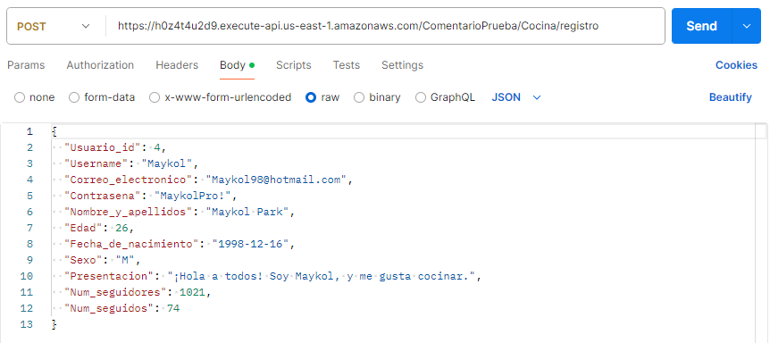
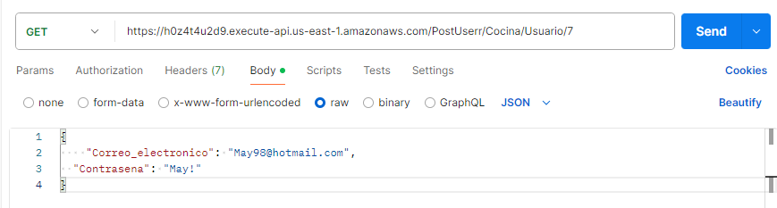
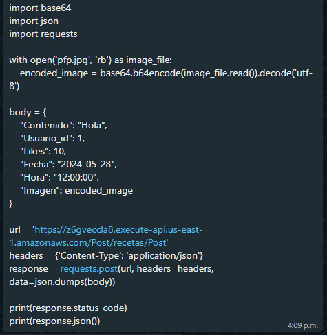

# BackendRecetas

## Usuarios

- **Registrar Usuario**:
  
  Metodo: Post
  - URL: `https://h0z4t4u2d9.execute-api.us-east-1.amazonaws.com/PostUserr/Cocina/registro`
    

- **Verificar Usuario**:
  
  Metodo: Post
  - URL: `https://h0z4t4u2d9.execute-api.us-east-1.amazonaws.com/PostUserr/Cocina/login`
    

- **Ver Perfil**:
  
  Metodo: Get
  - URL: `https://h0z4t4u2d9.execute-api.us-east-1.amazonaws.com/PostUserr/Cocina/Usuario/{Usuario_id}`

## Posts

- **Registrar Post**:
  
   Metodo: Post
  - URL: `https://h0z4t4u2d9.execute-api.us-east-1.amazonaws.com/PostUserr/Cocina/post`
    

- **Ver Todos los Posts**:
  
   Metodo: Get
  - URL: `https://h0z4t4u2d9.execute-api.us-east-1.amazonaws.com/PostUserr/Cocina/post`

- **Ver Posts de un Usuario**:
  
  Metodo: Get
  - URL: `https://h0z4t4u2d9.execute-api.us-east-1.amazonaws.com/PostUserr/Cocina/post/{Usuario_id}`

## Comentarios

- **Consultar Comentarios de un Post**:
  
  Método: Get
  - URL: `https://h0z4t4u2d9.execute-api.us-east-1.amazonaws.com/ComentarioPrueba/Cocina/comentario/consulta/{Post_id}`

- **Registrar Comentario**:

  Método: Post
         - URL: `https://h0z4t4u2d9.execute-api.us-east-1.amazonaws.com/PostUserr/Cocina/comentario`
 
  ## Visualización
 - **Registrar receta**:
   
      Método: Post
    
         - URL: `https://h0z4t4u2d9.execute-api.us-east-1.amazonaws.com/Receta/Cocina/recetas`

  - **Obtener recetas por id**

       Método: Get
     
        - URL: `https://h0z4t4u2d9.execute-api.us-east-1.amazonaws.com/Receta/Cocina/recetas/consulta/{Receta_id}`

 - **Obtener recetas por nombre**
  - URL:

